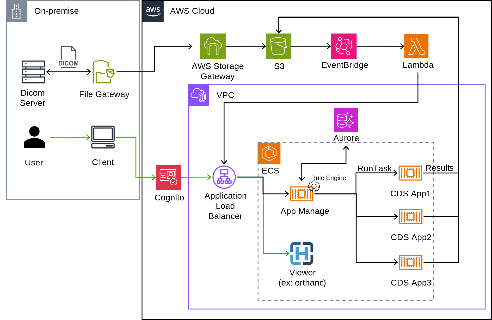

# Engineer-portfolio

本リポジトリは、転職活動における技術ポートフォリオとして作成しています。
主に以下の内容をまとめています：

- これまでの経歴とプロジェクト実績（要約）
- クラウド上における自動解析プラットフォーム構想の概要
- 今後取り組みたい開発・身に着けていきたい技術スタック など

※ライセンスは設定していませんが、本リポジトリ内の内容・図表等の無断使用はご遠慮ください。

## 実績と経験（概略）
- DICOM画像を対象とした医用画像自動解析システムの開発
- 心疾患解析アプリケーションのアルゴリズム要素開発
- 医用画像処理ワークステーションのデータ管理周りの開発
- 上記の医用画像自動解析システムのAWS SaaS化に向けたPoC検証
  
詳細はこちら
[docs/experiences.md](docs/experiences.md)

## クラウド上における自動解析プラットフォーム構想の概要
現在のPoC検討案です。今までの医療ITシステム開発の経験をもとに、AWS上の自動解析基盤として設計。
オンプレミス(またはクラウド上)の医用画像保管サーバと連携した臨床アプリケーションの自動解析プラットフォームを検討しています。
アプリケーションの自動解析基盤は、医用画像分野以外の別ドメインにおいても同様に適応可能かと思うので、将来の転職先で機会があれば提案していきたい。

- 想定ワークフロー
  - 検診のスクリーニング等、一度に大量のデータの解析や確認が必要になる場合を想定。
- 自動解析実行機能
  1. PACSに画像が登録されるとS3へアップロード
  2. Rule Engineで画像分類 → 適切なCDS AppをECS上で起動
  3. 解析結果をS3に保存
  4. Rule Engineで後続アプリケーションの有無を判定
- スケーラビリティ性
  - ECS基盤上でCDS Appをコンテナとして動作させることで、同時解析や高負荷時のオートスケールを想定。
    - 管理性と拡張性を考慮し、Kubernetes利用の検討も視野に入れる。
- 画像データ参照機能
  - ビューアアプリにS3をマウントさせて、解析結果を含む画像データを参照可能とする。

イメージ図はこちら

## 今後取り組みたい開発・身に着けていきたい技術スタック
1. SaaS化を志向したシステム設計・開発
2. モダンな技術を活用したWebアプリ開発
3. フロントエンド開発の知識の習得（Backend経験を中心としてきたため）