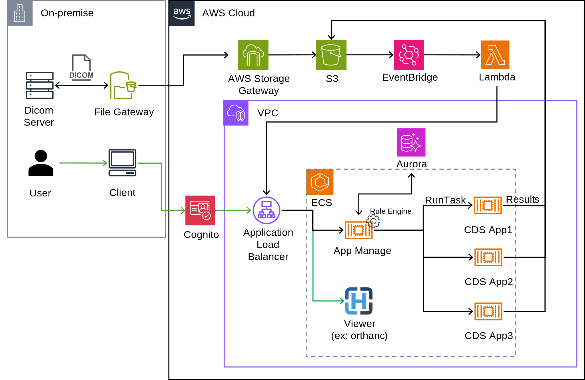

# Engineer-portfolio

本リポジトリは、転職活動における技術ポートフォリオとして作成しています。
主に以下の内容をまとめています：

- これまでの実務と経験
- クラウド上における自動解析プラットフォーム構想の概要
- 今後取り組みたい開発・身に着けていきたい技術スタック など

※ライセンスは設定していませんが、本リポジトリ内の内容・図表等の無断使用はご遠慮ください。

## これまでの実務と経験

### DICOM画像を対象とした医用画像自動解析システムの開発
* 利用技術
  * 言語：Java SpringBoot, C#(.NET)
  * IDE: Visual Studio Code
  * OS：Linux
  * Infra：Kubernetes, Containerd, PostgreSQL, Keycloak, Apache Kafka
  * CI: Jenkins, Ansible
* 期間：5年
* 主な業務内容：
  * 画像分類機能
    * Dicomメタ情報を活用して、撮影方法や撮影部位に基づく自動分類機能を検討・実装
    * ✅成果：手動での分類処理をなくし、画像の受信から解析までの全自動化が実現。
  * Kubernetesを用いた解析優先度の制御機能
    * Kubernetes APIを利用した解析アプリケーションの起動の優先度設定機能を検討・実装
    * ✅成果：KubernetesのPriorityClass機能を活用し、救急等、緊急性の高いアプリケーションを優先して実行できる基盤を導入。
  * OAuth2連携による外部モバイルViewerサーバへの通知機能
    * OAuthを活用し、解析完了時に外部Viewerに連携
    * ✅成果：解析完了通知をすることで、読影ワークフローの迅速化に貢献。
  * Ansibleスクリプトによるサーバ構築の自動化
    * JenkinsとAnsibleを連携させて、テストにおける環境構築を自動化
    * ✅成果：1台当たり、2時間から30分に短縮

### 心疾患解析アプリケーションのアルゴリズム要素開発
* 利用技術
  * 言語：C++
  * IDE：Visual Studio
* 期間：1年
* 主な業務内容：
  * 冠動脈の解析アルゴリズム
    * CT画像を使って心筋梗塞の原因となる冠動脈疾患の解析アルゴリズムを検討・実装
    * ✅成果：共同研究先の技師の方による評価にて約80%の解析精度で検出

### 医用画像処理ワークステーションのデータ管理周りの開発
* 利用技術
  * 言語：Java SpringBoot
  * IDE：Visual Studio Code
  * OS：Linux on WSL
  * Infra：PostgreSQL, RabbitMQ
* 期間：半年
* 主な業務内容：
  * 画像の受信・登録機能
    * Java SpringBootにおいてdcm4cheを利用した画像の受信・登録処理
    * ✅成果：前身となるワークステーションより受信・登録の速度性能の25%程度改善を達成

### 上記の医用画像自動解析システムのAWS SaaS化に向けたPoC検証
* 利用技術
  * Infra：AWS Systems Manager, Cognito, Application Load Balancer, Aurora, Automation Runbook
* 期間：1年
* 主な業務内容：
  * オンプレミス環境へのリモートインストールの検証
    * Systems Managerでオンプレミス環境に接続をして、自動インストールスクリプトを作成。
    * ✅成果：オンプレミス環境におけるサーバ構築作業がの時間を8割程度削減
  * 認証機能の検証。
    * Cognitoを用いて、AWS上にデプロイされるサービスにアクセスする際の認証機能を検証。
    * ✅成果：従来用いていたKeycloakとのOAuth仕様との比較を完了。

## クラウド上における自動解析プラットフォーム構想の概要
現在のPoC検討案です。今までの医療ITシステム開発の経験をもとに、AWS上の自動解析基盤として設計。
オンプレミス(またはクラウド上)の医用画像保管サーバと連携した臨床アプリケーションの自動解析プラットフォームを検討しています。
アプリケーションの自動解析基盤は、医用画像分野以外の別ドメインにおいても同様に適応可能かと思うので、将来の転職先で機会があれば提案していきたい。

- 想定ワークフロー
  - 検診のスクリーニング等、一度に大量のデータの解析や確認が必要になる場合を想定。
- 自動解析実行機能
  1. PACSに画像が登録されるとS3へアップロード
  2. Rule Engineで画像分類 → 適切なCDS AppをECS上で起動
  3. 解析結果をS3に保存
  4. Rule Engineで後続アプリケーションの有無を判定
- スケーラビリティ性
  - ECS基盤上でCDS Appをコンテナとして動作させることで、同時解析や高負荷時のオートスケールを想定。
    - 管理性と拡張性を考慮し、Kubernetes利用の検討も視野に入れる。
- 画像データ参照機能
  - ビューアアプリにS3をマウントさせて、解析結果を含む画像データを参照可能とする。

イメージ図はこちら

## 今後取り組みたい開発・身に着けていきたい技術スタック
1. SaaS化を志向したシステム設計・開発
2. モダンな技術を活用したWebアプリ開発
3. フロントエンド開発の知識の習得（Backend経験を中心としてきたため）